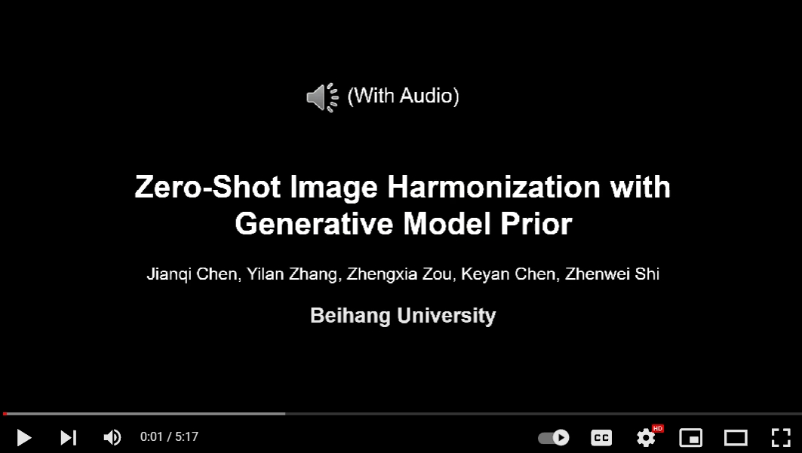
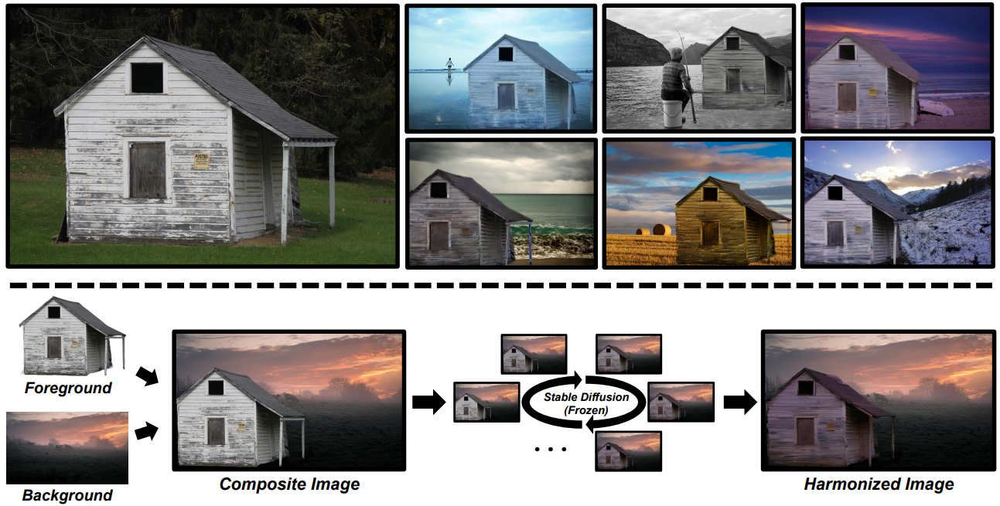
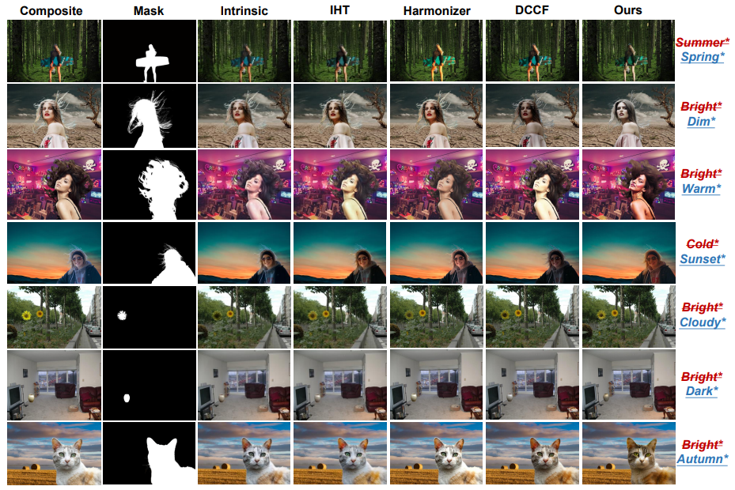

<div align="center">

<h1><a href="https://arxiv.org/abs/2307.08182">Zero-Shot Image Harmonization with <br /> Generative Model Prior</a></h1>

**[Jianqi Chen](https://windvchen.github.io/), [Yilan Zhang](https://scholar.google.com.hk/citations?hl=en&user=wZ4M4ecAAAAJ), [Zhengxia Zou](https://scholar.google.com.hk/citations?hl=en&user=DzwoyZsAAAAJ), [Keyan Chen](https://scholar.google.com.hk/citations?hl=en&user=5RF4ia8AAAAJ), and [Zhenwei Shi](https://scholar.google.com.hk/citations?hl=en&user=kNhFWQIAAAAJ)**


[](#License)
[](https://arxiv.org/abs/2307.08182)

</div>


<div align="center">
<a href="https://www.youtube.com/watch?v=mfBTIVp6JBU&t=4s"></a>
</div>

### Share us a :star: if this repo does help

This is the official repository of ***Diff-Harmonization***. The newest version of the paper can be accessed in [[IEEE](https://ieeexplore.ieee.org/abstract/document/10858769)], the previous version of the paper can be accessed in [[arXiv](https://arxiv.org/abs/2307.08182)]. ***(Accepted by TMM 2025)***

If you encounter any question, please feel free to contact us. You can create an issue or just send email to me windvchen@gmail.com. Also welcome for any idea exchange and discussion.

BTW:
You may wish to pay attention to our another work 😊[***INR-Harmonization***](https://github.com/WindVChen/INR-Harmonization). It is **the first dense pixel-to-pixel method applicable to high-resolution (*~6K*) images** without any hand-crafted filter design, based on *Implicit Neural Representation*,.

## Updates

[**02/06/2025**] This paper has been accepted by **TMM 2025**.

[**03/10/2024**] Release the version 2 of our paper (access it from [here](https://arxiv.org/abs/2307.08182), previous paper can still be accessed from [here](https://arxiv.org/abs/2307.08182v1)), together with the code! 🧐🧐 In this new version, we mainly have these updates:

- Prompts (object name and imaging conditions) can now be automatically generated by incorporating Google Genmini VLM into our pipeline. (See Sec. 3.1).
- Content structure is further preserved by leveraging edge maps. (See Sec. 3.2)
- Imaging descriptions can support more than one word now. (See Sec. 3.2)
- An automatic performance evaluation and result selection process is incorporated. (See Sec. 3.3)

[**09/05/2023**] Code has been publicly accessible.👋👋 We are working🏃🏃 on further improvements to the method (see **Appendix D** of the paper) to provide a better user experience, so stay tuned for more updates.

[**07/18/2023**] Repository init.

## TODO
- [x] Code release
- [x] Support multiple words' description.
- [x] Automate the generation of the initial environmental text
- [x] Further improve the content preservation

Possible future work (See **Limitation** of the paper-v2):
- [ ] Speed up

## Table of Contents

- [Abstract](#abstract)
- [Requirements](#requirements)
- [Harmonizing](#harmonizing)
  - [Harmonize a single image](#harmonize-a-single-image)
  - [Harmonize a bunch of images](#harmonize-a-bunch-of-images)
- [Results](#results)
- [Citation & Acknowledgments](#citation--acknowledgments)
- [License](#license)


## Abstract


We propose a zero-shot approach to image harmonization, aiming to overcome the reliance on large amounts of synthetic composite images in existing methods. These methods, while showing promising results, involve significant training expenses and often struggle with generalization to unseen images. To this end, we introduce **a fully modularized framework inspired by human behavior**. Leveraging the reasoning capabilities of recent foundation models in language and vision, our approach comprises three main stages. Initially, we employ a pretrained vision-language model (VLM) to generate descriptions for the composite image. Subsequently, these descriptions guide the foreground harmonization direction of a text-to-image generative model (T2I). We refine text embeddings for enhanced representation of imaging conditions and employ self-attention and edge maps for structure preservation. Following each harmonization iteration, an evaluator determines whether to conclude or modify the harmonization direction. **The resulting framework, mirroring human behavior, achieves harmonious results without the need for extensive training.** We present compelling visual results across diverse scenes and objects, along with a user study validating the effectiveness of our approach.

## Requirements

1. Hardware Requirements
    - GPU: 1x high-end NVIDIA GPU with at least 20GB memory

2. Software Requirements
    - Python: 3.9 or above
    - CUDA: 11.3
    - cuDNN: 8.4.1

   To install other requirements, please check [requirements.txt](requirements.txt), or directly run the following command:

   ```
   pip install -r requirements.txt
   ```

3. Data preparation
   - There have been demo data in [demo](demo), you can directly run the code below to see the results.
   - If you want to test your own data, please follow the format of the demo data. Specifically, you need to prepare `composite image` and `mask image`, and `caption`.
   - For automatically generating captions, please run [gemini_mini_vision.py](gemini_mini_vision.py). Remember to modify the variables like `api_key`, `images_root`, `masks_root`, etc., in advance.

4. Pre-trained Models
   - We adopt `Stable Diffusion 2.0` as our diffusion model, you can load the pretrained weight by setting `pretrained_diffusion_path="stabilityai/stable-diffusion-2-base"` in [main.py](main.py).

## Harmonizing

The code supports either harmonize a single image, or harmonize a bunch of images. When the harmonization loop is finished, you can manually select the best one among a number of harmonized results, or directly use the result named `final_output` which is automatically selected. 

(**Note:** Since Diff-Harmonization is a Zero-Shot method, the results are not always good. If generating bad results, we recommend you to try different initial environmental text to get the best results.)

### Harmonize a single image

```bash
python main.py --harmonize_iterations 10 --save_dir "./output" --is_single_image --image_path "./demo/girl_comp.jpg" --mask_path "./demo/girl_mask.jpg" --foreground_prompt "girl autumn" --background_prompt "girl winter" --pretrained_diffusion_path "stabilityai/stable-diffusion-2-base" --use_edge_map
```

- `--harmonize_iterations`: the iterations' number of harmonization loop. This will be aligned with the results' number saved in the output directory.
- `--save_dir`: the directory to save the harmonized image.
- `--is_single_image`: harmonize a single image.
- `--image_path`: the path of the composite image.
- `--mask_path`: the path of the mask image.
- `--foreground_prompt`: the prompt describing foreground environment.
- `--background_prompt`: the prompt describing background environment.
- `--pretrained_diffusion_path`: the path of the pretrained diffusion model.
- `--use_edge_map`: whether to use edge maps to preserve structure.
- (optional) `--use_evaluator`: whether automatically select image.
- ... (Please refer to [main.py](main.py) for more options.)

### Harmonize a bunch of images

```bash
python main.py --harmonize_iterations 10 --save_dir "./output" --images_root "./demo/composite" --mask_path "./demo/mask" --caption_txt "./demo/caption.txt" --pretrained_diffusion_path "stabilityai/stable-diffusion-2-base" --use_edge_map
```

- `--harmonize_iterations`: the iterations' number of harmonization loop. This will be aligned with the results' number saved in the output directory.
- `--save_dir`: the directory to save the harmonized image.
- `--images_root`: the root directory of the composite images.
- `--mask_path`: the path of the mask image.
- `--caption_txt`: the path of the caption file.
- `--pretrained_diffusion_path`: the path of the pretrained diffusion model.
- `--use_edge_map`: whether to use edge maps to preserve structure.
- (optional) `--use_evaluator`: whether automatically select image.
- ... (Please refer to [main.py](main.py) for more options.)


## Results

<div align=center></div>
<div align=center></div>
<div align=center></div>
<div align=center></div>

## Citation & Acknowledgments
If you find this paper useful in your research, please consider citing:
```
@ARTICLE{10858769,
  author={Chen, Jianqi and Zhang, Yilan and Zou, Zhengxia and Chen, Keyan and Shi, Zhenwei},
  journal={IEEE Transactions on Multimedia}, 
  title={Zero-Shot Image Harmonization with Generative Model Prior}, 
  year={2025},
  volume={},
  number={},
  pages={1-15},
  keywords={Imaging;Training;Text to image;Image color analysis;Image edge detection;Image segmentation;Visualization;Solid modeling;Costs;Transforms;Image harmonization;image composition;diffusion model;zero-shot method},
  doi={10.1109/TMM.2025.3535343}}
```

Also thanks for the open source code of [Prompt-to-Prompt](https://github.com/google/prompt-to-prompt). Some of our codes are based on them.

## License
This project is licensed under the Apache-2.0 license. See [LICENSE](LICENSE) for details.