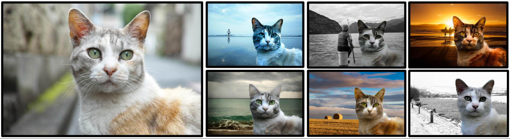
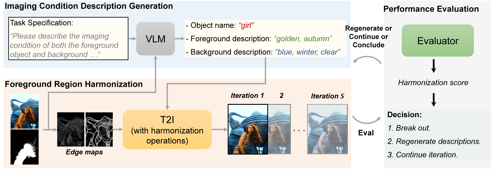
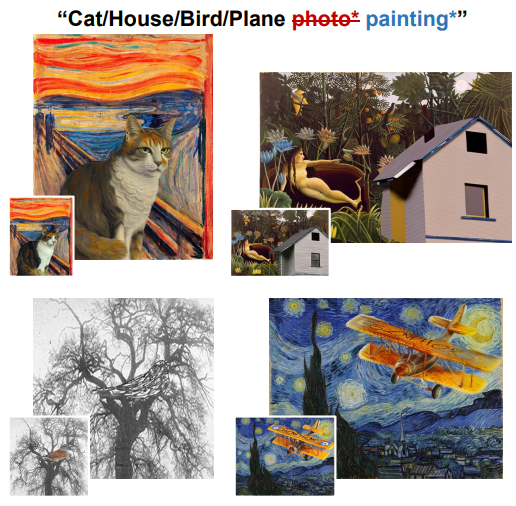

<div align="center">

<h1><a href="https://arxiv.org/abs/2307.08182">Zero-Shot Image Harmonization with <br /> Generative Model Prior</a></h1>

**[Jianqi Chen](https://windvchen.github.io/), [Zhengxia Zou](https://scholar.google.com.hk/citations?hl=en&user=DzwoyZsAAAAJ), [Yilan Zhang](https://scholar.google.com.hk/citations?hl=en&user=wZ4M4ecAAAAJ), [Keyan Chen](https://scholar.google.com.hk/citations?hl=en&user=5RF4ia8AAAAJ), and [Zhenwei Shi](https://scholar.google.com.hk/citations?hl=en&user=kNhFWQIAAAAJ)**


[](#License)
[](https://arxiv.org/abs/2307.08182)

</div>



<div align="center">

</div>

### Share us a :star: if this repo does help

This is the official repository of ***Diff-Harmonization***. If you encounter any question, please feel free to contact us. You can create an issue or just send email to me windvchen@gmail.com. Also welcome for any idea exchange and discussion.

BTW:
You may wish to pay attention to our another work 😊[***INR-Harmonization***](https://github.com/WindVChen/INR-Harmonization). It is **the first dense pixel-to-pixel method applicable to high-resolution (*~6K*) images** without any hand-crafted filter design, based on *Implicit Neural Representation*,.

## Updates

[**09/05/2023**] Code has been publicly accessible.👋👋 We are working🏃🏃 on further improvements to the method (see **Appendix D** of the paper) to provide a better user experience, so stay tuned for more updates.

[**07/18/2023**] Repository init.

## TODO
- [x] Code release

Possible future work (See **Appendix D** of the paper):
- [ ] Automate the generation of the initial environmental text
- [ ] Further improve the content preservation
- [ ] Speed up

## Table of Contents

- [Abstract](#abstract)
- [Requirements](#requirements)
- [Harmonizing](#harmonizing)
  - [Harmonize a single image](#harmonize-a-single-image)
  - [Harmonize a bunch of images](#harmonize-a-bunch-of-images)
- [Results](#results)
- [Citation & Acknowledgments](#citation--acknowledgments)
- [License](#license)


## Abstract



Recent image harmonization methods have demonstrated promising results. However, due to their heavy reliance on a large number of composite images, these works are expensive in the training phase and often fail to generalize to unseen images. In this paper, we draw lessons from **human behavior** and come up with a **zero-shot image harmonization** method. Specifically, in the harmonization process, a human mainly utilizes his long-term prior on harmonious images and makes a composite image close to that prior. To imitate that, we resort to pretrained generative models for the prior of natural images. For the guidance of the harmonization direction, we propose an Attention-Constraint Text which is optimized to well illustrate the image environments. Some further designs are introduced for preserving the foreground content structure. The resulting framework, highly consistent with human behavior, can achieve harmonious results without burdensome training. Extensive experiments have demonstrated the effectiveness of our approach, and we have also explored some interesting applications.

## Requirements

1. Hardware Requirements
    - GPU: 1x high-end NVIDIA GPU with at least 20GB memory

2. Software Requirements
    - Python: 3.8
    - CUDA: 11.3
    - cuDNN: 8.4.1

   To install other requirements, please check [requirements.txt](requirements.txt), or directly run the following command:

   ```
   pip install -r requirements.txt
   ```

3. Data preparation
   - There have been demo data in [demo](demo), you can directly run the code below to see the results.
   - If you want to test your own data, please follow the format of the demo data. Specifically, you need to prepare `composite image` and `mask image`, and `caption`.

4. Pre-trained Models
   - We adopt `Stable Diffusion 2.0` as our diffusion model, you can load the pretrained weight by setting `pretrained_diffusion_path="stabilityai/stable-diffusion-2-base"` in [main.py](main.py).

## Harmonizing

The code supports either harmonize a single image, or harmonize a bunch of images. When the harmonization loop is finished, you can cherrypick the best one among a number of harmonized results. 

(**Note:** Since Diff-Harmonization is a Zero-Shot method, the results are not always good. If generating bad results, we recommend you to try different initial environmental text to get the best results.)

### Harmonize a single image

```bash
python main.py --harmonize_iterations 10 --save_dir "./output" --is_single_image --image_path "./demo/girl_comp.jpg" --mask_path "./demo/girl_mask.jpg" --foreground_prompt "girl autumn" --background_prompt "girl winter" --pretrained_diffusion_path "stabilityai/stable-diffusion-2-base"
```

- `--harmonize_iterations`: the iterations' number of harmonization loop. This will be aligned with the results' number saved in the output directory.
- `--save_dir`: the directory to save the harmonized image.
- `--is_single_image`: harmonize a single image.
- `--image_path`: the path of the composite image.
- `--mask_path`: the path of the mask image.
- `--foreground_prompt`: the prompt describing foreground environment.
- `--background_prompt`: the prompt describing background environment.
- `--pretrained_diffusion_path`: the path of the pretrained diffusion model.
- (Optional) `--text_optimization_style` (default: `optimize`): the optimization style of the text. You can choose `optimize` or `train`.
- ... (Please refer to [main.py](main.py) for more options.)

### Harmonize a bunch of images

```bash
python main.py --harmonize_iterations 10 --save_dir "./output" --images_root "./demo/composite" --mask_path "./demo/mask" --caption_txt "./demo/caption.txt" --pretrained_diffusion_path "stabilityai/stable-diffusion-2-base"
```

- `--harmonize_iterations`: the iterations' number of harmonization loop. This will be aligned with the results' number saved in the output directory.
- `--save_dir`: the directory to save the harmonized image.
- `--images_root`: the root directory of the composite images.
- `--mask_path`: the path of the mask image.
- `--caption_txt`: the path of the caption file.
- `--pretrained_diffusion_path`: the path of the pretrained diffusion model.
- - (Optional) `--text_optimization_style` (default: `optimize`): the optimization style of the text. You can choose `optimize` or `train`.
- ... (Please refer to [main.py](main.py) for more options.)


## Results


<div align=center></div>

## Citation & Acknowledgments
If you find this paper useful in your research, please consider citing:
```
@article{chen2023zero,
  title={Zero-Shot Image Harmonization with Generative Model Prior},
  author={Chen, Jianqi and Zou, Zhengxia and Zhang, Yilan and Chen, Keyan and Shi, Zhenwei},
  journal={arXiv preprint arXiv:2307.08182},
  year={2023}
}
```

Also thanks for the open source code of [Prompt-to-Prompt](https://github.com/google/prompt-to-prompt). Some of our codes are based on them.

## License
This project is licensed under the Apache-2.0 license. See [LICENSE](LICENSE) for details.